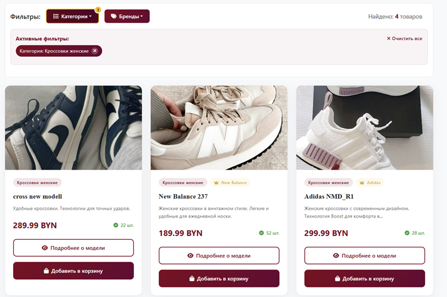
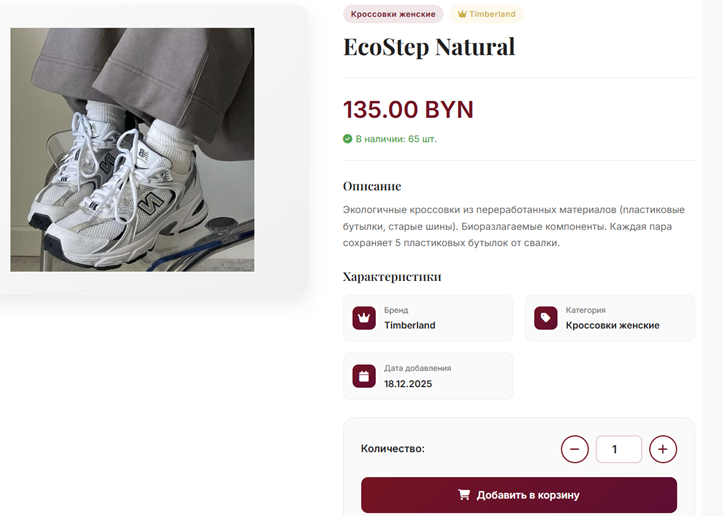
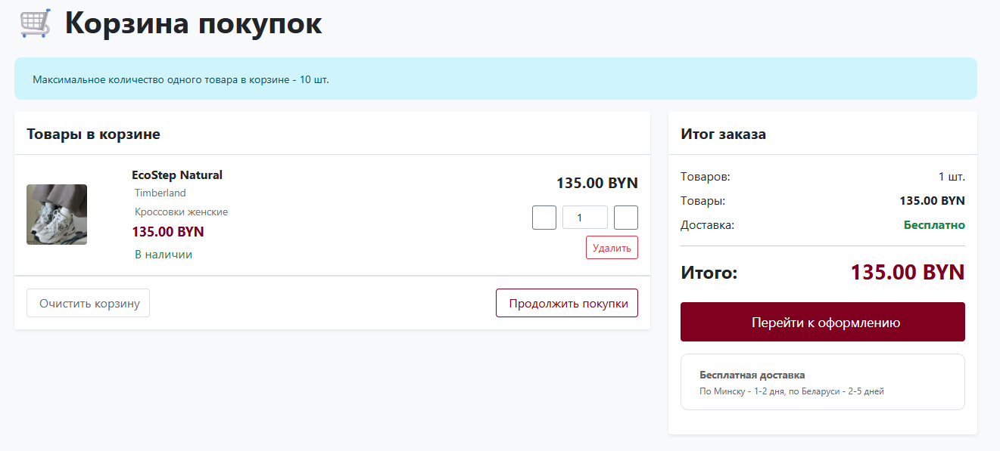
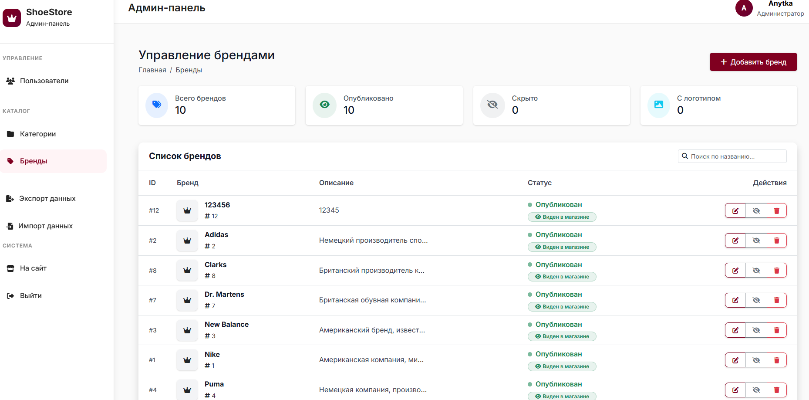

Платформа для интернет-магазина обуви. Проект включает в себя полноценный функционал магазина, систему управления контентом (CMS) и инструменты для администратора.

## Основные возможности

### Для пользователей:
- **Каталог товаров:** Фильтрация по категориям, брендам и поиск.
- **Корзина:** Интерактивная корзина с API-логикой (добавление, удаление, пересчет суммы без перезагрузки).
- **Личный кабинет:** Профиль пользователя, загрузка аватара.
- **Система отзывов:** Оценки и комментарии к товарам с ограничением «1 пользователь — 1 отзыв».
- **Безопасность:** Регистрация и вход с подтверждением через Email. Защита от SQL-инъекций.

### Для администраторов (Admin Panel):
- **Дашборд:** Статистика магазина в реальном времени.
- **Управление данными:** Полный CRUD для товаров, категорий и брендов.
- **Экспорт/Импорт:** Выгрузка данных в CSV/ZIP и массовое добавление товаров через CSV-шаблоны.
- **Модерация:** Управление пользователями и их ролями.

### Структура проекта
**app/admin/** — Логика панели администратора.
**app/shop/** — Основной функционал магазина (каталог, корзина, заказы).
**app/models/** — Описание сущностей базы данных.
**app/templates/** — HTML шаблоны.
**app/export_service.py** — Сервис экспорта данных.
**app/import_service.py** — Сервис импорта данных.

## Технологический стек

- **Backend:** Python 3.10+, Flask
- **Database:** PostgreSQL
- **Frontend:** Templates, HTML5, CSS3, JavaScript
- **Auth:** Flask-Login, Werkzeug Security
- **Forms:** Flask-WTF, WTForms

# 1. Клонирование репозитория

git clone https://github.com/ak-ann/shoe_shop.git
cd shoe-shop

2. Создание виртуального окружения
python -m venv venv
source venv/bin/activate  # Linux / macOS
 # или
venv\Scripts\activate     # Windows

3. Установка зависимостей
pip install -r requirements.txt

4. Настройка базы данных
Создайте файл config.py на основе примера:
cp config.example.py config.py

5. Запуск приложения
flask run

##  Screenshots

### Главная страница

### Каталог с фильтрацией

### Страница товара

### Корзина

### Админ-панель — управление брендами

